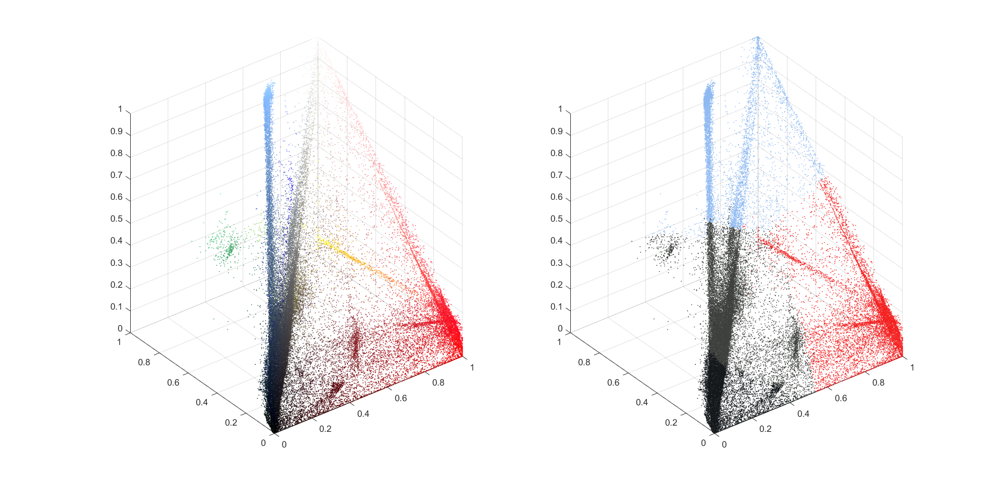

# Image Compression with K - Means Clustering

## Clustering
 
Clustering is an unsupervised learning problem where we are given a set of data points that have to be partitioned into a given number of groups or clusters.

## K - Means Clustering

K - means clustering aims to partition a set of $N$ vectors/obserations into $K$ clusters with each observation belonging to a cluster with the nearest centroid. Centroid of a cluster is the mean of all vectors/observations belonging to that cluster. Mathematically, let the given N observations be vectors $(x_1,x_2,...x_N)$ of dimension(features) $D$. Let $C_1, C_2, C_3...C_K $ be $K$ clusters and $\mu_1,\mu_2,...\mu_K$ be the mean of vectors contained in them respectively. The K - means clustering aims to minimize the sum Euclidean distances between the data points and the centroid of thier respective clusters. Hence, the objective is to find - 

#####  

## The Standard Algorithm

This algorithm begins with initializing the $K$ centroids as randomly chosen points in the given data set itself. A certain number of iterations are then run in which, the points in the data set are labelled with the closest of the $K$ centroids and the centroids are updated with the mean of all data points with the same labelling. After the iterations, the centroid closest to a point in the data set marks the cluster in with it belongs.

## Image Compression
### Pixels of an Image

In a standard $24$-bit colour representation of an image, each pixel is represented by three $8$ bit unsigned integers(ranging from $0$ to $255$) that specify the red, green and blue(RGB) intensiy values. 

### Clustering of Pixels

Given an image with thousands of colours, consider each pixel as a three-dimensional vector of RGB values. If these pixels are K-means clustered into, say $16$ clusters using the above algorithm and the colour of each pixel changed to the colour represented by the centroid of the cluster to which it belongs, the number of colours in the image can be reduced to $16$. Doing so reduces/compresses the file size by up to $6$ times as now we have to store the RGB values of only these $16$ colours and each pixel can be represented with only $4$ bit unsigned integers(ranging from $0$ to $15$).

## Demonstration

We are going to use the following $500\times500$ image for K-means clustering the pixels to 16 colours.

This image has a file size of 458 KB with pixels of $57678$ different colours.

The [main](main.m) function cotains all the parameters for the Algorithm. We set the number of iterations(max_iters) to $10$ and number of clusters $K$ to $16$. Matrix $A$ stores the RGB value of all $500\times500$ pixels as a matrix of dimensions $500\times500\times3$. These parameters are passed to the [Interations](Iterations.m) function to run the algorithm.

The MATLAB [script](Script.mlx) is to call the [main](main.m) function.

On running the script for 16 clusters, we get the following output 

This image has a file size of 142 KB (Success!). The image has only changed with the colour of some pixels.

In order to clearly visulize the effect of clustering, we will intensify the change from the original image by decreasing the number of colours to only $4$(i.e. changing $K$ to $4$ in [main](main.m))

On running the script for 4 clusters, we get the following output 

This image has a file size of 37 KB (Success!).

Here it is clearly visible how the colour scheme has changed. If we create a [3D Scatter Plot](ClusterVisuals4.fig) of the pixels with the X,Y,Z coordinates representing the RGB intensities, the $4$ Clusters can be seen.

